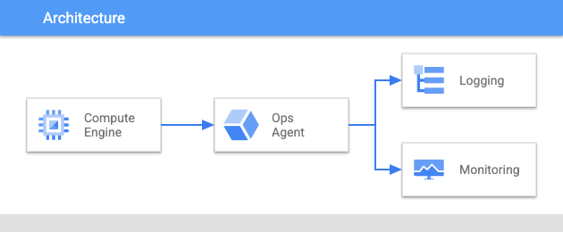

# Deploy Stack - Ops Agent 

This stack creates a Compute Engine Instance and installs the Ops Agent on it
for exploring logging and monitoring with a ready made solution. 

## Install
You can install this application using the `Open in Google Cloud Shell` button 
below. 

Once this opens up, you can install by: 
1. Typing `./deploystack install`

## Cleanup 
To remove all billing components from the project
1. Typing `./deploystack uninstall`

This is not an official Google product.
